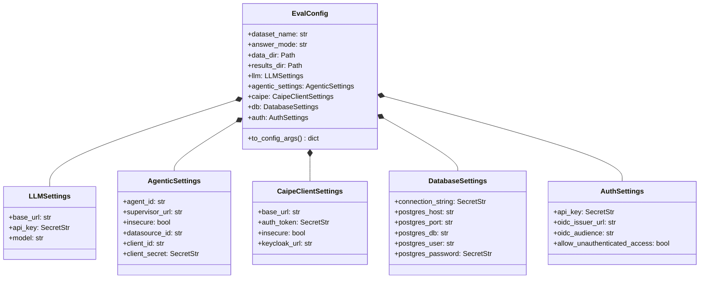

# Architecture

This project is a small evaluation harness around CAIPE rag-server. It does not implement CAIPE itself. It prepares benchmark data, sends documents to CAIPE ingestion endpoints, queries CAIPE retrieval, generates answers from retrieved context, and scores the result with DeepEval.

## High-Level Architecture

~~~mermaid
flowchart LR
    subgraph Benchmarks
        A[EnterpriseRAG-Bench]
        B[HotpotQA]
    end

    subgraph DatasetModules
        C[enterprise_dataset.py]
        D[hotpotqa_dataset.py]
    end

    subgraph LocalOutputs
        E[data corpus files]
        F[data question files]
    end

    subgraph CAIPE
        G[rag-server ingest endpoints]
        H[rag-server query endpoint]
    end

    subgraph Evaluation
        I[retrieved contexts]
        J[LLM answer generation]
        K[DeepEval judge]
        L[metrics.py]
        M[results JSON and CSV]
    end

    A --> C
    B --> D
    C --> E
    C --> F
    D --> E
    D --> F
    E --> G
    F --> H
    H --> I
    I --> J
    J --> K
    I --> L
    K --> L
    L --> M
~~~

## Runtime Components

| Component | File | Responsibility |
| --- | --- | --- |
| REST API Evaluation Service entry point | src/deepeval_eval/api/service.py | FastAPI REST API service with Swagger UI (/docs) for async job execution, deduplication, question set CRUD, and DB persistence. |
| Question Sets & Questions API router | src/deepeval_eval/api/question_sets.py | REST endpoints for Question Sets and Questions CRUD, parsing, batch upload, and export. |
| Ingestion entry point | src/deepeval_eval/ingest/ingest_cli.py | Standalone CLI entry point for dataset ingestion into CAIPE datasources. |
| Enterprise command entry point | src/deepeval_eval/ingest/enterprise_deepeval.py | CLI for EnterpriseRAG-Bench ingestion and evaluation. |
| HotpotQA command entry point | src/deepeval_eval/ingest/hotpotqa_deepeval.py | CLI for HotpotQA ingestion and evaluation. |
| CAIPE client | src/deepeval_eval/clients/caipe.py | Wraps rag-server REST calls and extracts retrieved contexts and source metadata. |
| RAG client adapter | src/deepeval_eval/clients/rag.py | Unified RAG client adapter for CAIPE and Agentic RAG endpoints. |
| Precomputed RAG client | src/deepeval_eval/clients/oracle.py | Precomputed evaluation client handling offline or reference modes. |
| Database Manager (Base) | src/deepeval_eval/db/db_manager.py | Base PostgreSQL connection manager delegating to domain-specific DB managers. |
| Question DB Manager | src/deepeval_eval/db/question_db_manager.py | PostgreSQL DB manager for question_sets and questions schema, queries, search, and transactions. |
| Evaluation DB Manager | src/deepeval_eval/db/evaluation_db_manager.py | PostgreSQL DB manager for evaluation job queue, runs, and result tables. |
| Configuration | [src/deepeval_eval/core/config.py](file:///Users/alexanghh/development/CaipeDeepevalEvaluation/src/deepeval_eval/core/config.py) | Centralized Pydantic-based configuration management, settings objects, environment variable remapping, and secret masking. |
| LLM adapter | src/deepeval_eval/clients/llm_client.py | Calls an OpenAI compatible LLM endpoint and adapts it to DeepEval. |
| Shared metrics | src/deepeval_eval/core/metrics.py | Builds DeepEval metrics and computes document ID and short answer checks. |
| Enterprise dataset logic | src/deepeval_eval/datasets/enterprise.py | Downloads and samples EnterpriseRAG-Bench questions and source slices. |
| HotpotQA dataset logic | src/deepeval_eval/datasets/hotpotqa.py | Reads preprocessed HotpotQA zip files and selects gold documents plus distractors. |

| IO helpers | src/deepeval_eval/io_utils.py | Downloads cached files and reads generated JSONL question files. |

## CAIPE Interaction

The CAIPE client uses these rag-server endpoints:

| Endpoint | Used for |
| --- | --- |
| POST /v1/ingestor/heartbeat | Register the ingestion source and obtain batch limits. |
| POST /v1/datasource | Create or update a datasource record. |
| DELETE /v1/datasource | Reset a datasource when requested. |
| POST /v1/job | Open an ingestion job. |
| POST /v1/ingest | Send document batches into CAIPE. |
| POST /v1/job/{job_id}/increment-document-count | Update CAIPE job document count after each batch. |
| POST /v1/job/{job_id}/increment-progress | Update CAIPE job progress after each batch. |
| PATCH /v1/job/{job_id} | Mark ingestion complete. |
| POST /v1/query | Retrieve contexts for each evaluation question. |

Authentication is optional in the code. If an auth token is supplied, it is sent as a Bearer token. Automatic token fetching is not implemented and is to be confirmed.

## LLM and DeepEval Interaction

The evaluation step uses two model-facing roles:

| Role | Implementation |
| --- | --- |
| Answer generation | OpenAICompatibleClient sends a prompt containing the question and retrieved contexts. |
| DeepEval judge | DeepEvalJudge adapts the same OpenAI compatible client to DeepEval expected model interface. |

Both use the resolved OPENAI_ENDPOINT, OPENAI_API_KEY, and OPENAI_MODEL_NAME values.

## Data Flow Summary

1. Dataset-specific modules build a bounded local corpus and a matching question set.
2. The generated corpus is ingested into CAIPE as a datasource.
3. Evaluation reads generated questions from data.
4. For each question, CAIPE is queried through /v1/query.
5. Retrieved contexts are passed to the LLM to generate an answer.
6. DeepEval metrics and retrieval checks are computed.
7. Results are written to timestamped JSON and CSV files.

## Configuration & Settings Architecture

Configuration management in [config.py](file:///Users/alexanghh/development/CaipeDeepevalEvaluation/src/deepeval_eval/core/config.py) is built around Pydantic `BaseSettings` (`pydantic-settings`) to provide a single, strongly-typed source of truth across CLI entrypoints, REST API endpoints, database sinks, and LLM/RAG clients.

### Domain Settings Hierarchy

Settings are structured into modular Pydantic models, combined into a top-level composite `EvalConfig`:

### Core Design Principles & Rules

1. **Dependency Injection Primacy**:
   - Core runtime classes (e.g., `CAIPEClient`, `AgenticRAGAdapter`, `PostgresResultSink`, `OpenAICompatibleClient`, `DatabaseManager`) MUST accept explicit domain settings objects or explicit parameters in their `__init__` constructors.
   - The global singleton `get_eval_config()` (backed by `@lru_cache`) is reserved for CLI entrypoints and default fallback parameter resolution. Internal classes and service handlers MUST NOT hardcode calls to `get_eval_config()` internally when injected settings can be passed.

2. **Environment Variable Fallback Order (`AliasChoices`)**:
   - Environment variables are resolved via Pydantic `AliasChoices` in strict precedence order (e.g., `DATABASE_URL` -> `LANGGRAPH_CHECKPOINT_POSTGRES_DSN` -> `POSTGRES_DSN` -> `DB_CONNECTION_STRING`).
   - `.env` file loading is disabled by default (`DEEPEVAL_DISABLE_DOTENV=1`) to prevent unexpected local `.env` pollution in production or CI environments.

3. **Security & Secret Masking (`SecretStr`)**:
   - All credentials (API keys, client secrets, database passwords, DSNs) MUST be typed as `SecretStr`.
   - `to_config_args()` produces sanitized, log-safe dictionaries by filtering out `SecretStr` fields and keys matching sensitive patterns (`key`, `secret`, `token`, `password`, `dsn`).

4. **Backward Compatibility Bridges**:
   - Flat property getters/setters on `EvalConfig` (e.g., `llm_base_url`, `supervisor_url`, `datasource_id`) and standalone resolver functions (`resolve_llm_settings`, `resolve_caipe_base_url`, `load_agentic_config`) bridge legacy signatures to domain settings objects.

